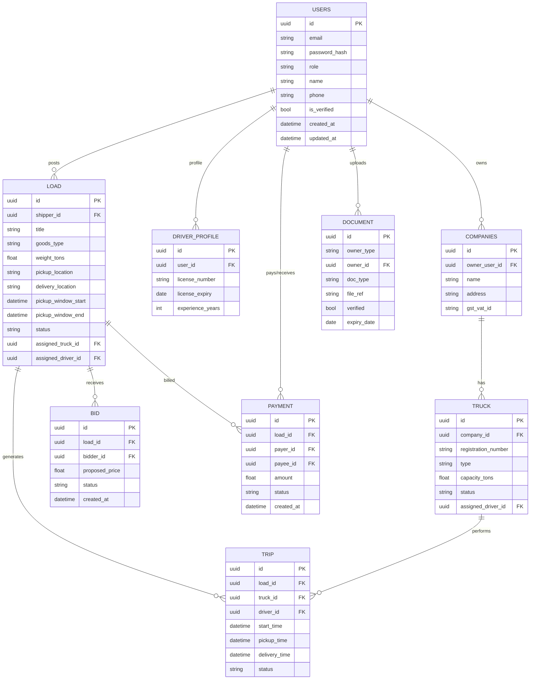

## FleetFlow ERD (Mermaid)

The entity-relationship diagram below describes the core relational models for FleetFlow.

File: ERD.md — rendered with Mermaid; use a Mermaid viewer or the included preview.
